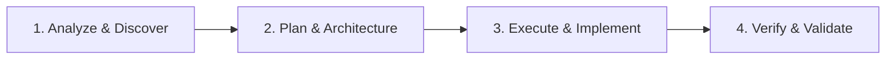

# Development Workflow

Pedoman langkah kerja terstruktur (*SOP*) dalam menyelesaikan tugas, refactoring, maupun implementasi fitur baru di repositori ini.

---

## 🔄 Siklus Eksekusi 4 Tahap

---

### 1. Analyze & Discover (Analisis Kebutuhan)
- Baca pedoman arsitektur terkait di direktori `.agents/` (`nextjs/`, `typescript/`, `frontend/`, `backend/`).
- Telusuri codebase yang ada, struktur direktori, reusable components, types/interfaces yang sudah tersedia.
- Identifikasi dependensi, potensi side-effects, dan batasan teknis sebelum menyentuh file.

### 2. Plan & Architecture (Perencanaan)
- Untuk tugas kompleks atau refactor besar: susun rencana langkah demi langkah.
- Tentukan layer arsitektur:
  - *Data layer*: Schema DB / ORM, Data Access Layer (DAL).
  - *Business logic*: Service, Server Actions, API Route.
  - *Presentation*: Server Component (RSC) vs Client Component (`'use client'`).
- Tentukan kontrak tipe data (Types/Interfaces) dan skema validasi (Zod) sebelum menulis implementasi logika.

### 3. Execute & Implement (Implementasi)
- Tulis kode dengan prinsip modularitas, clean code, dan strictly-typed.
- Terapkan standar UI project: Flat design, Minimalist, solid borders, konsisten dengan design system.
- Hindari duplikasi kode: manfaatkan utilitas bersama (`lib/`, `utils/`, `hooks/`, `components/ui/`).
- Sertakan error boundary, loading states (Suspense/skeleton), dan feedback interaktif bagi user.

### 4. Verify & Validate (Verifikasi)
- Lakukan pengecekan tipe data (`type-check` / TypeScript compiler) dan linter.
- Uji skenario umum (*happy path*) dan skenario batas (*edge cases* / error handling).
- Pastikan tidak ada console log debug yang tertinggal atau file temporary yang tidak diperlukan.
