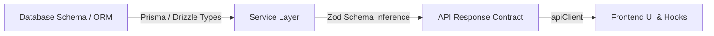

# Keamanan Tipe Data (Type Safety)

Pedoman menjaga integritas tipe data di seluruh lapisan aplikasi (Database $\rightarrow$ Server $\rightarrow$ Client UI) untuk mencegah runtime errors.

---

## 🛡️ 1. End-to-End Type Safety

Pastikan tipe data mengalir tanpa terputus dari Backend ke Frontend:



---

## 🔍 2. Type Narrowing & Custom Type Guards

Jangan gunakan casting `(item as SpecificType)` secara membabi buta. Gunakan pengecekan tipe runtime atau *User-Defined Type Guards*:

```typescript
// Contoh User-Defined Type Guard
export function isApiError(error: unknown): error is { message: string; statusCode: number } {
  return (
    typeof error === "object" &&
    error !== null &&
    "message" in error &&
    "statusCode" in error &&
    typeof (error as any).statusCode === "number"
  );
}

// Penggunaan yang aman
try {
  // ...
} catch (error) {
  if (isApiError(error)) {
    console.error(`Error Code ${error.statusCode}: ${error.message}`);
  }
}
```

---

## 🚦 3. Exhaustive Type Checking dengan `never`

Gunakan tipe `never` pada blok `switch...case` untuk memastikan semua kemungkinan varian Union tertangani oleh compiler:

```typescript
type NotificationType = "email" | "sms" | "push";

function sendNotification(type: NotificationType) {
  switch (type) {
    case "email":
      // Kirim email
      break;
    case "sms":
      // Kirim sms
      break;
    case "push":
      // Kirim push notification
      break;
    default:
      // Jika ada union baru ditambahkan, compiler akan error di sini!
      const _unreachable: never = type;
      throw new Error(`Unhandled notification type: ${_unreachable}`);
  }
}
```

---

## 📦 4. Utilitas Utility Types Bawaan

Manfaatkan utility types bawaan TypeScript alih-alih membuat tipe duplikat:
- `Partial<T>`: Mengubah semua properti menjadi opsional.
- `Required<T>`: Mengubah semua properti menjadi wajib.
- `Pick<T, K>`: Memilih sebagian subset properti.
- `Omit<T, K>`: Membuang properti tertentu (misal: `Omit<User, "passwordHash">`).
- `Record<K, V>`: Kamus key-value bertipe.