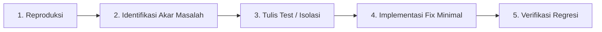

# Prosedur Perbaikan Bug (Bug Fix Workflow)

Standar operasional prosedur (SOP) saat mendiagnosis, mereproduksi, memperbaiki, dan memverifikasi bug pada aplikasi.

---

## 🔍 Alur Kerja 5 Langkah

---

### 1. Reproduksi Masalah (Reproduce)
- Dapatkan konteks lengkap: payload input, URL rute, kondisi data, pesan error di console/server, dan browser yang digunakan.
- Coba simulasikan error secara konsisten di lingkungan lokal.

### 2. Identifikasi Akar Masalah (Root Cause Analysis)
- Lacak alur eksekusi dari Controller/Page $\rightarrow$ Service $\rightarrow$ Database/External API.
- Cari tahu mengapa bug terjadi (misal: *unhandled null/undefined*, kesalahan skema Zod, race condition, query N+1, atau CSS layout break).
- Jangan hanya menambal gejala di permukaan; temukan penyebab intinya.

### 3. Implementasi Perbaikan Minimal (Minimal & Clean Fix)
- Buat perbaikan yang terfokus pada akar masalah tanpa mengubah fungsi atau modul lain yang tidak terkait (*avoid unnecessary scope creep*).
- Pertahankan standar strictly-typed dan error handling terpusat.

### 4. Verifikasi & Uji Regresi (Verify & Regression Check)
- Uji skenario yang sebelumnya gagal untuk memastikan masalah teratasi.
- Uji skenario sukses (*happy path*) di modul terkait untuk memastikan perbaikan tidak memicu efek samping baru (*regression*).
- Hapus semua `console.log` debug sementara sebelum menyelesaikan pekerjaan.
