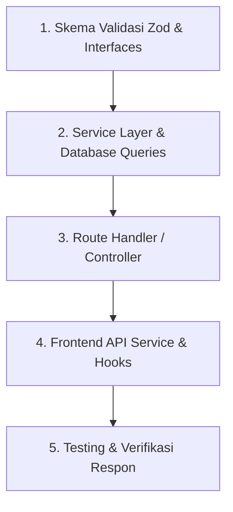

# Prosedur Pembuatan API Baru (New API Workflow)

Standar langkah-langkah membuat endpoint API baru di Next.js App Router secara modular (*Feature-Driven*).

---

## 🛠️ Alur Pembuatan API Baru



---

### Langkah 1: Buat Skema & Tipe Data
Buka atau buat file di `src/modules/[feature]/[feature].schema.ts` dan definisikan skema Zod serta inferensi tipenya:
```typescript
import { z } from "zod";

export const createProductSchema = z.object({
  name: z.string().trim().min(3),
  price: z.number().positive(),
  stock: z.number().int().nonnegative().default(0),
}).strict();

export type CreateProductInput = z.infer<typeof createProductSchema>;
```

### Langkah 2: Buat Logika Bisnis di Service Layer
Tulis query dan business rules di `src/modules/[feature]/[feature].service.ts`:
```typescript
import { db } from "@/common/db";
import { AppError } from "@/common/errors/app-error";
import { CreateProductInput } from "./products.schema";

export const productService = {
  create: async (data: CreateProductInput, userId: string) => {
    // Validasi aturan bisnis tambahan jika ada
    const product = await db.product.create({
      data: {
        ...data,
        ownerId: userId,
      },
    });
    return product;
  },
};
```

### Langkah 3: Buat Route Handler
Buat file di `src/app/api/[feature]/route.ts`:
```typescript
import { NextRequest, NextResponse } from "next/server";
import { productService } from "@/modules/products/products.service";
import { createProductSchema } from "@/modules/products/products.schema";
import { handleApiError } from "@/common/utils/error-handler.util";

export async function POST(req: NextRequest) {
  try {
    const body = await req.json();
    const validatedData = createProductSchema.parse(body);
    const userId = req.headers.get("x-user-id") || "anonymous";

    const result = await productService.create(validatedData, userId);

    return NextResponse.json(
      {
        status: true,
        message: "Produk berhasil dibuat",
        data: [result],
      },
      { status: 201 }
    );
  } catch (error) {
    return handleApiError(error);
  }
}
```

### Langkah 4: Buat Client API Service Wrapper
Daftarkan fungsi API di `src/modules/[feature]/services/[feature].api.ts` agar siap dipanggil oleh Frontend/Page secara aman.