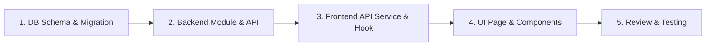

# Prosedur Pembuatan Fitur Baru (New Feature Workflow)

Standar operasional prosedur (SOP) end-to-end dalam membangun satu fitur fungsional utuh (*full feature*) dari Database hingga Frontend UI.

---

## 🚀 Alur Pengembangan Fitur Baru

---

### 1. Database & Domain Modeling
- Tentukan tabel dan relasi di skema ORM (Prisma / Drizzle).
- Buat dan jalankan migrasi database (`prisma migrate dev` / `drizzle-kit generate`).

### 2. Backend Module (`src/modules/[feature]/`)
- Buat `[feature].schema.ts`: Skema validasi Zod untuk mutasi dan query.
- Buat `[feature].service.ts`: Logika bisnis, validasi kepemilikan data, dan query ORM.
- Buat Route Handlers di `src/app/api/[feature]/route.ts` (dan sub-rute `[id]/route.ts` jika diperlukan).

### 3. Frontend API Integration Layer
- Buat `src/modules/[feature]/[feature].api.ts` menggunakan helper `apiClient`.
- Buat custom React Query hook atau mutation hook di `src/modules/[feature]/[feature].hooks.ts` jika fitur memerlukan interaktivitas client yang dinamis.

### 4. Frontend UI & Halaman (`src/app/`)
- Buat rute halaman di `src/app/(dashboard)/[feature]/page.tsx` sebagai Server Component.
- Tambahkan file pendukung rute: `loading.tsx` (Skeleton) dan `error.tsx` (Error boundary).
- Buat komponen spesifik fitur di `_components/` (misal: modal form, list table, action menu).

### 5. Review & Testing
- Jalankan pengecekan TypeScript (`tsc --noEmit`) dan linter.
- Uji integrasi skenario berhasil (*create, read, update, delete*) dan skenario validasi error.