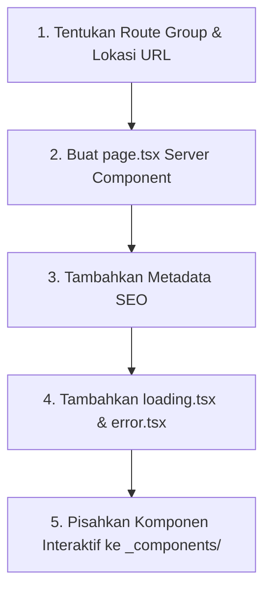

# Prosedur Pembuatan Halaman Baru (New Page Workflow)

Standar langkah-langkah membuat halaman rute baru di Next.js App Router yang cepat, terstruktur, SEO-friendly, dan memiliki UX mulus.

---

## 📄 Alur Pembuatan Halaman Baru



---

### Langkah 1: Tentukan Lokasi Rute
- Gunakan Route Groups yang sesuai:
  - Halaman publik: `src/app/(marketing)/about/page.tsx`
  - Halaman otentikasi: `src/app/(auth)/login/page.tsx`
  - Halaman dashboard: `src/app/(dashboard)/settings/page.tsx`

### Langkah 2: Buat `page.tsx` (Server Component)
Panggil API Service Layer langsung pada Server Component:
```tsx
import { Metadata } from "next";
import { settingApi } from "@/modules/settings/settings.api";
import { SettingForm } from "./_components/setting-form";

export const metadata: Metadata = {
  title: "Pengaturan Akun",
  description: "Kelola preferensi dan profil akun Anda.",
};

export default async function SettingsPage() {
  const { data: settings } = await settingApi.getSettings();

  return (
    <div className="space-y-6">
      <div>
        <h1 className="text-2xl font-bold">Pengaturan</h1>
        <p className="text-sm text-muted-foreground">Kelola konfigurasi sistem Anda.</p>
      </div>

      <SettingForm initialData={settings} />
    </div>
  );
}
```

### Langkah 3: Sediakan `loading.tsx` & `error.tsx`
- Buat `loading.tsx` yang merender Skeleton placeholder agar halaman tidak kosong saat data sedang diambil.
- Buat `error.tsx` (`'use client'`) untuk menangkap kegagalan fetch dengan tombol retry.