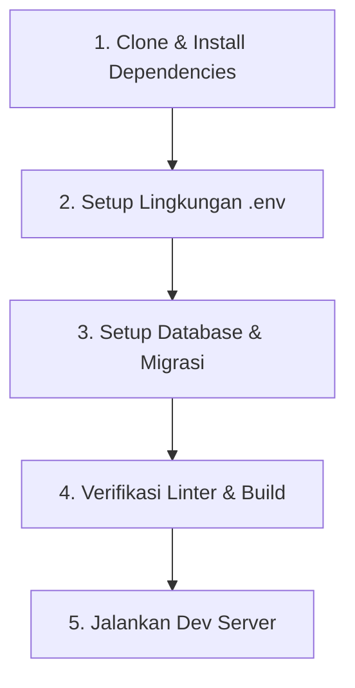

# Prosedur Inisialisasi Proyek Baru (New Project Workflow)

Panduan langkah demi langkah saat menyiapkan atau menyelaraskan proyek baru berbasis boilerplate Next.js ini.

---

## 🚀 Alur Inisialisasi Proyek



---

### Langkah 1: Instalasi Dependensi
Jalankan package manager standar yang digunakan proyek (misal `pnpm`, `npm`, atau `bun`):
```bash
npm install
# atau
pnpm install
```

### Langkah 2: Konfigurasi Environment Variables
Salin template `.env.example` ke `.env.local`:
```bash
cp .env.example .env.local
```
Lengkapi variabel penting:
- `DATABASE_URL`: Connection string PostgreSQL / MySQL.
- `JWT_SECRET`: Kunci rahasia hashing token JWT.
- `NEXT_PUBLIC_APP_URL`: URL lokal aplikasi (misal `http://localhost:3000`).

### Langkah 3: Setup Database & Skema
Jalankan migrasi dan seeding data awal:
```bash
npx prisma migrate dev
# atau
npx drizzle-kit push
```

### Langkah 4: Verifikasi Kesiapan & Build
Pastikan tidak ada error tipe data sebelum memulai pengembangan fitur:
```bash
npm run type-check # tsc --noEmit
npm run lint
```

### Langkah 5: Mulai Development Server
```bash
npm run dev
```
Buka browser pada `http://localhost:3000`.