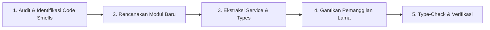

# Prosedur Refactoring Kode (Refactor Workflow)

Standar operasional prosedur saat merestrukturisasi, mengoptimasi, atau membersihkan kode tanpa mengubah fungsionalitas eksternal.

---

## 🧼 Prinsip Utama Refactoring

1. **Jaga Fungsionalitas Tetap Sama**: Refactoring hanya mengubah struktur internal kode demi keterbacaan, efisiensi, dan kemudahan pemeliharaan; bukan menambah atau mengubah perilaku fitur.
2. **Langkah Inkremental**: Lakukan perubahan kecil bertahap, bukan rewrite besar-besaran sekaligus yang sulit di-debug.
3. **Strict Type-Safety**: Pastikan tidak ada type degradation (seperti membiarkan tipe menjadi `any`) selama proses pemindahan kode.

---

## 🛠️ Alur Refactoring Terstruktur

---

### Contoh Kasus Refactoring Umum:
- **Memindahkan Raw Fetch di Page ke API Service Layer**:
  1. Buat DTO types & Zod schema di `src/modules/[feature]/`.
  2. Buat file `[feature].api.ts` di folder `services/`.
  3. Ganti pemanggilan `fetch()` mentah di dalam file halaman dengan `await [feature]Api.getMethod()`.
- **Memecah Monolithic Component**:
  1. Pisahkan form fields kompleks atau baris tabel menjadi sub-komponen terpisah di `_components/`.
  2. Gunakan TypeScript interface untuk props sub-komponen.
- **Menghilangkan Duplikasi Utilitas**:
  1. Pindahkan helper yang dipakai berulang ke `src/common/utils/` atau `src/lib/`.